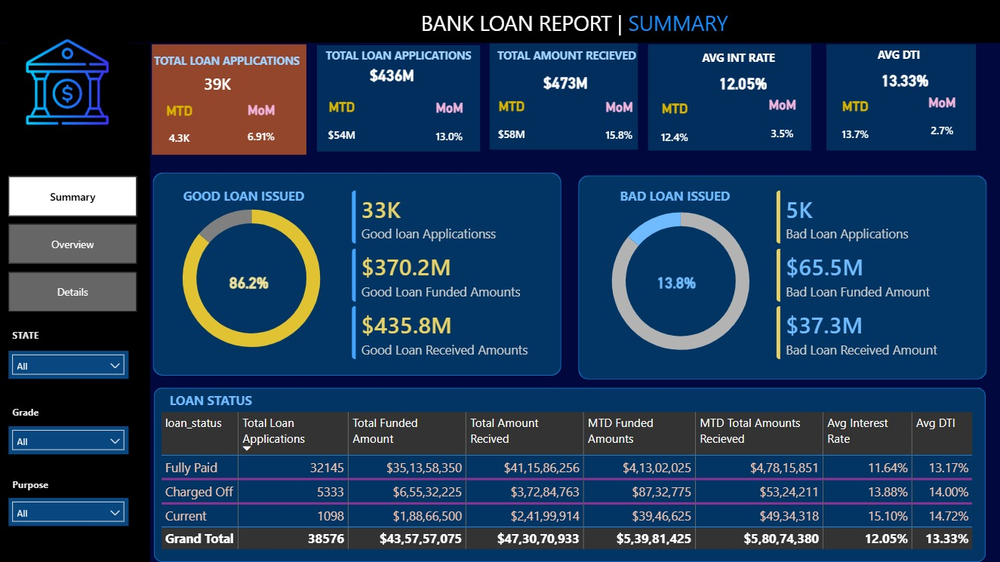
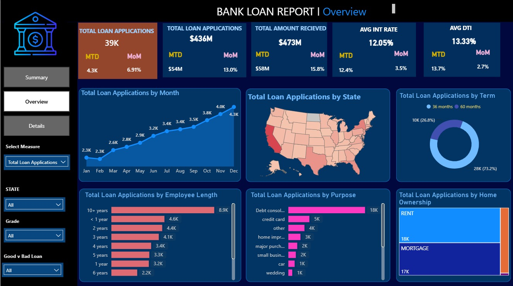
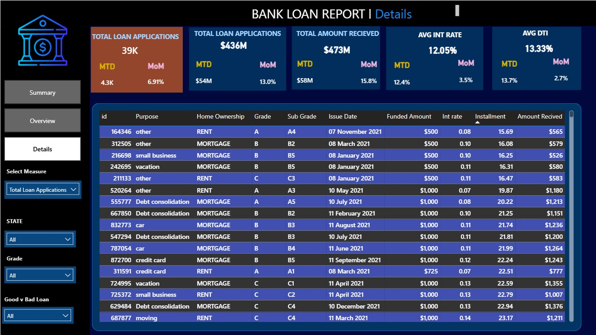

# Bank Loan Analysis

This project is a Bank Loan Analysis Dashboard developed using SQL and Power BI. The dashboard helps analyze loan applications, funded amount, loan repayments, and customer loan performance through interactive visualizations.

## Tools Used

- SQL (MySQL)
- Power BI
- DAX
- Excel

## Dataset

The project uses the `financial_loan.csv` dataset.

## Dashboard Pages

### Summary
- Total Loan Applications
- Total Funded Amount
- Total Amount Received
- Average Interest Rate
- Good Loan vs Bad Loan

### Overview
- Monthly Trends
- State-wise Analysis
- Loan Purpose
- Home Ownership
- Employee Length

### Details
- Complete loan records with interactive filters.

## SQL Work

SQL was used to:
- Calculate KPIs
- Analyze loan status
- Compare good and bad loans
- Generate monthly reports
- Perform state-wise analysis

The SQL queries are included in:
- `Bank_Loan_SQL_Screenshots_Ordered.docx`

## Dashboard Preview

### Summary

### Overview

### Details

## Files

- `Bank_Loan_Analysis.pbix` - Power BI Dashboard
- `financial_loan.csv` - Dataset
- `Bank_Loan_SQL_Screenshots_Ordered.docx` - SQL Queries
- Dashboard screenshots

## Author

Kumkum Sharma
